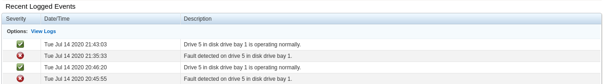

# localdisk
Example project showing how the libstoragemgmt-golang package can be used to interact with the libstoragemgmt library. The libstoragemgmt library (LSM), provides interfaces to perform common storage tasks across a variety of backends. This example code, focuses solely on localdisk interaction.

Obviously, as an admin you can just run the lsmcli commands directly, but this project shows how you can interact with libstoragemgmt programmatically for automation, or platform integration.

## Prerequisites
1. For build and testing you need the following rpms installed on your system
- libstoragemgmt
- libstoragemgmt-devel
2. For running on a host the host must have the libstoragemgmt rpm installed.  

3. To run either lsmcli or this code, the user requires r/w privileges to the device (root normally)  

## Build
The localdisk package within libstoragemgmt-golang uses **cgo** to interact with the libstoragemgmt api, so to build you need to point the linker at the local machines install location of the libstoragemgmt library  
e.g.

```
# CGO_LDFLAGS=/usr/lib64/libstoragemgmt.so go build -o localdisk
```

## Running the tool
1. Example options
```
localdisk -h
Usage of localdisk:
  -disk-fail-led-off string
        de-activate fail LED on a given device
  -disk-fail-led-on string
        activate fail LED on a given device
  -list
        list all local disks
```
2. Turn on fail LED
```
localdisk -disk-fail-led-on /dev/sda
```
3. Turn off fail beacon
```
localdisk -disk-fail-led-off /dev/sda
```

## Output Examples
1. Disk list
```
[root@srv-01 ~]# localdisk -list
Device Path      Serial Number          Size     Type   RPM Bus Speed       IDENT        FAIL  Health
/dev/sda         15P0A0R0FRD6      585937500      SAS 10000      6000     UNKNOWN         OFF    Good
/dev/sdb         15P0A0YFFRD6      585937500      SAS 10000      6000     UNKNOWN         OFF    Good
/dev/sdk         15P0A0ONFRD6      585937500      SAS 10000      6000     UNKNOWN         OFF    Good
/dev/sdl         15P0A0YBFRD6      585937500      SAS 10000      6000     UNKNOWN         OFF    Good
/dev/sdm         BTWL452503K7480QGN   937703088 IDE/SATA     0      6000     UNKNOWN         OFF Unknown
/dev/sdn         BTWL452503PJ480QGN   937703088 IDE/SATA     0      6000     UNKNOWN         OFF Unknown
/dev/sdo         BTWL452503K2480QGN   937703088 IDE/SATA     0      6000     UNKNOWN         OFF Unknown
/dev/sdp         BTWL452503PF480QGN   937703088 IDE/SATA     0      6000     UNKNOWN         OFF Unknown
/dev/sdc         15R0A08WFRD6      585937500      SAS 10000      6000     UNKNOWN         OFF    Good
/dev/sdd         15R0A07DFRD6      585937500      SAS 10000      6000     UNKNOWN         OFF    Good
/dev/sde         15P0A0QDFRD6      585937500      SAS 10000      6000     UNKNOWN         OFF    Good
/dev/sdf         15R0A064FRD6      585937500      SAS 10000      6000     UNKNOWN         OFF    Good
/dev/sdg         15P0A0QWFRD6      585937500      SAS 10000      6000     UNKNOWN         OFF    Good
/dev/sdh         15P0A0O8FRD6      585937500      SAS 10000      6000     UNKNOWN         OFF    Good
/dev/sdi         15P0A0RFFRD6      585937500      SAS 10000      6000     UNKNOWN         OFF    Good
/dev/sdj         15R0A07PFRD6      585937500      SAS 10000      6000     UNKNOWN         OFF    Good
```
2. Turning on the fail LED
```
[root@srv-01 ~]# localdisk -list 
Device Path      Serial Number          Size     Type   RPM Bus Speed       IDENT        FAIL  Health
/dev/sda         15P0A0R0FRD6      585937500      SAS 10000      6000     UNKNOWN         OFF    Good
:
/dev/sdf         15R0A064FRD6      585937500      SAS 10000      6000     UNKNOWN         OFF    Good
/dev/sdg         15P0A0QWFRD6      585937500      SAS 10000      6000     UNKNOWN         OFF    Good
/dev/sdh         15P0A0O8FRD6      585937500      SAS 10000      6000     UNKNOWN         OFF    Good
/dev/sdi         15P0A0RFFRD6      585937500      SAS 10000      6000     UNKNOWN         OFF    Good
/dev/sdj         15R0A07PFRD6      585937500      SAS 10000      6000     UNKNOWN         OFF    Good


[root@srv-01 ~]# localdisk -disk-fail-led-on /dev/sdf
[root@srv-01 ~]# localdisk -list 
Device Path      Serial Number          Size     Type   RPM Bus Speed       IDENT        FAIL  Health
/dev/sda         15P0A0R0FRD6      585937500      SAS 10000      6000     UNKNOWN         OFF    Good
:
/dev/sdf         15R0A064FRD6      585937500      SAS 10000      6000     UNKNOWN          ON    Good   <---
/dev/sdg         15P0A0QWFRD6      585937500      SAS 10000      6000     UNKNOWN         OFF    Good
/dev/sdh         15P0A0O8FRD6      585937500      SAS 10000      6000     UNKNOWN         OFF    Good
/dev/sdi         15P0A0RFFRD6      585937500      SAS 10000      6000     UNKNOWN         OFF    Good
/dev/sdj         15R0A07PFRD6      585937500      SAS 10000      6000     UNKNOWN         OFF    Good

[root@srv-01 ~]# localdisk -disk-fail-led-off /dev/sdf
[root@srv-01 ~]# localdisk -list 
Device Path      Serial Number          Size     Type   RPM Bus Speed       IDENT        FAIL  Health
/dev/sda         15P0A0R0FRD6      585937500      SAS 10000      6000     UNKNOWN         OFF    Good

/dev/sdf         15R0A064FRD6      585937500      SAS 10000      6000     UNKNOWN         OFF    Good   <---
/dev/sdg         15P0A0QWFRD6      585937500      SAS 10000      6000     UNKNOWN         OFF    Good
/dev/sdh         15P0A0O8FRD6      585937500      SAS 10000      6000     UNKNOWN         OFF    Good
/dev/sdi         15P0A0RFFRD6      585937500      SAS 10000      6000     UNKNOWN         OFF    Good
/dev/sdj         15R0A07PFRD6      585937500      SAS 10000      6000     UNKNOWN         OFF    Good

```
  
After running this process, the changes to the fault LED could be seen in the server's BMC  
  
